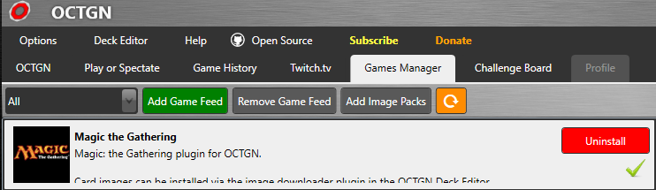
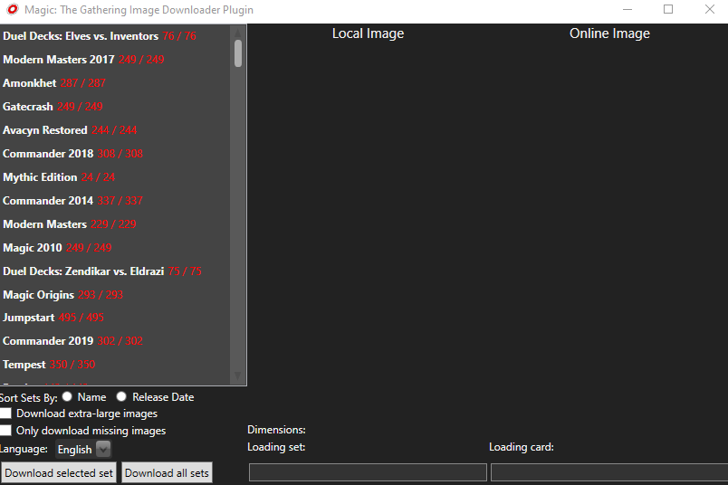

## Magic the Gathering OCTGN Game Package

Thank you for your interest in the MTG game package on OCTGN.  Getting started is super easy!  Follow these steps to begin:

### Install Magic: the Gathering

The game package can be located in OCTGN's Ganes Manager.  Scroll down until you find **Magic the Gathering**, click it, then click the green **install** button.  You should get a check mark once it's installed.

### Install Card Images

OCTGN's game packages do not come installed with all of the card images.  The MTG game package includes a convenient _deck editor plugin_ which can locate and automatically install missing card images.

1. Open OCTGN's deck editor.
2. Under the **Deck** menu, select **New** -> **Magic the Gathering**
3. Allow OCTGN to load the MTG card database (may take a few seconds)
4. Under the **Plugins** menu, select **Magic: the Gathering Image Downloader**

5. You can choose from different configurations for your images, such as image resolution and language.  Sets can be installed one at a time, or you can click **Download all sets** to get them all at once.

### More information

If you have any questions, please visit OCTGN's Discord server: https://discord.com/invite/Yn3Jrpj
